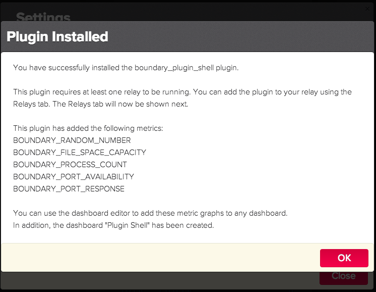

Boundary Plugin Shell
=====================

Boundary Plugin Shell is generic plugin that allows the use of any program or scripting language to produce metrics for the Boundary Premium product.

## Installation

## Examples

### Random Number

### Requirements
1. Bash

### Configuration

## Developers

### Key Abstractions
