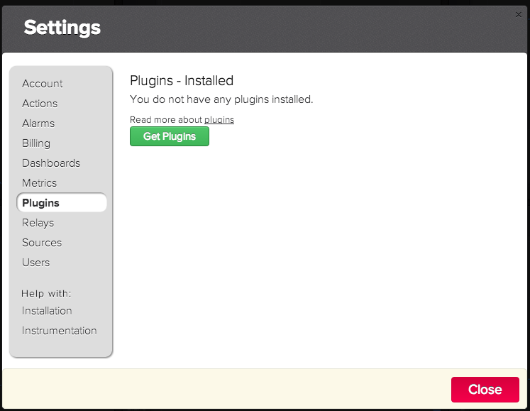
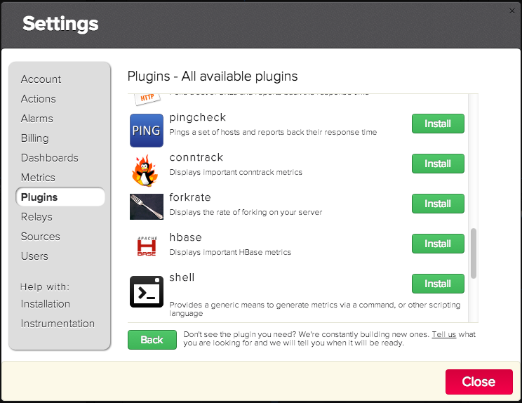
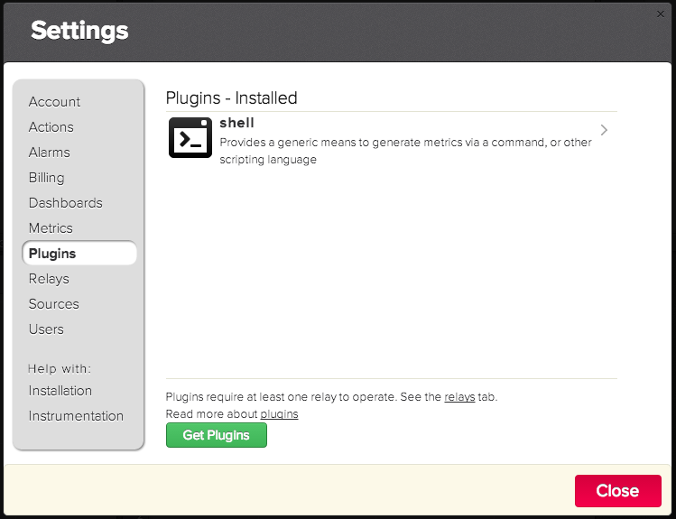
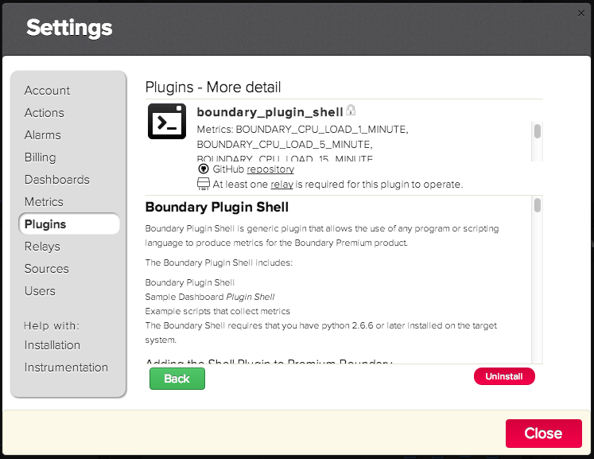
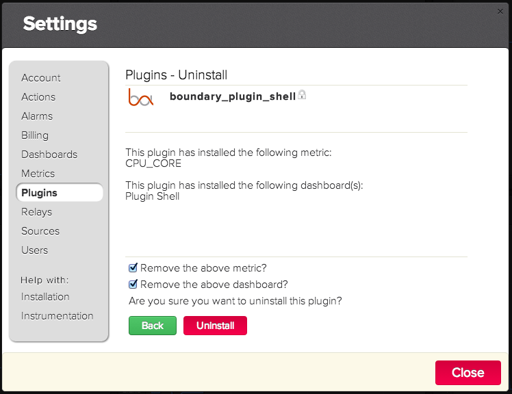

Boundary Plugin Shell
=====================

Boundary Plugin Shell is generic plugin that allows the use of any program or scripting language to produce metrics for the Boundary Premium product.

The Boundary Plugin Shell includes:

1. Boundary Plugin Shell
2. Sample Dashboard _Plugin Shell_
3. Example scripts that collect metrics

## Adding the Shell Plugin to Premium Boundary

1. Login into Boundary Premium
2. Display the settings dialog by clicking on the _settings icon_: 
3. Click on the _Plugins_ in the settings dialog: 

4. Local the _boundary\_plugin\_shell_ and click on the _Install_ button.


5. A confirmation dialog is displayed indicating the plugin was installed sucessfull along with the metrics and the dashboards that were configure:


6. Click on the _OK_ button to dismiss the dialog.

## Removing the Shell Plugin from Premium Boundary

1. Login into Boundary Premium
2. Display the settings dialog by clicking on the _settings icon_: 

3. Click on the _Plugins_ in the settings dialog which lists the installed plugins: 
4. Locate the _boundary\_plugin\_shell_ and click on the item, which then displays the uninstall dialog:


5. Click on the _Uninstall_ button which then displays a confirmation dialog along with the details on what metrics and dashboards will be removed.

6. Click on the _Uninstall_ button to perfom the actual uninstall and then click on the _Close_ button to dismiss the dialog.

## Configuration

Once the Shell Plugin is installed a metric to be collected requires configuration. Configuration of a Shell Plugin to collect metrics requires that a _relay_ is installed. Instructions on how to install a relay for linux/unix can found [here](http://premium-documentation.boundary.com/relays), and for Windows [here](http://premium-support.boundary.com/customer/portal/articles/1656465-installing-relay-on-windows).

General operations for plugins are describe in this [article](http://premium-support.boundary.com/customer/portal/articles/1635550-plugins---how-to)

### Overview of the Steps to Create a Shell Plugin Metric

1. Define the metric
2. Write the script that collects the metric (see _Plugin Shell Protocol_)
3. Configure the metric in the Plugin Shell

### Configuring an Example Shell Plugin Metric

#### Defining a Metric

1. Login into Boundary Premium
2. Display the settings dialog by clicking on the _settings icon_: 

3. Click on _Metrics_ in the left hand side of the dialog which then displays the _Metrics_ dialog:


4. Click on the _Create Metric_ button which displays a form to define a new metric. Fill out the form as shown here:


5. Click on the _Save_ button to create the metric.

6. Click on the _Close_ button to dismiss the dialog.

#### Write a Script that Collects the Metric

This step is going to be short cut by providing an already created script the counts the number of files in a directory. The example script is called [nfiles](scripts/nfiles.sh)


#### Configuring a Metric within the Shell Plugin
1. Login into Boundary Premium
2. Display the settings dialog by clicking on the _settings icon_: 

3. Click on the _Relay_ to display the list of installed Relays.


4. Click on a relay in the list which then shows a list of the plugins installed on the Relay.


5. Click on the _Add a plugin_ drop down menu and select _boundary\_plugin\_script_.


6. Click on the _Add a Metric Command_ fill out the form as shown here:


7. Click on the _Save_ button to save the configuration.


7. The relay console is then displayed showing the plugin loading. Click on the _Close_ button to dismiss the dialog.


#### Creating a Dashboard to Display the Metric

See [Building a Dashboard - How To](http://premium-support.boundary.com/customer/portal/articles/1635547-building-a-dashboard---how-to) to create a dashboard to display the metric configured above.

## Plugin Shell Protocol

Collection of your own defined metric requires a program or script to:

1. Collect, by any means the desired metric
2. Write the collected metric value, along with the metric name, and source to [standard output](http://en.wikipedia.org/wiki/Standard_output) with an accompanying new line.

Here Bash shell code snipet that illustrates

```bash
### Collect the metric

# List the directory, count the lines, and remove white space
file_count=$(ls -1 $directory_path | wc -l | tr -d ' ')

### Write the metric standard out

echo "FILE_COUNT $file_count $(hostname)"
```

Here is yet another snipet that gets the collects and outputs the processor load in a single line of code:

```bash
echo $(uptime) $(hostname) | awk '{printf("LOAD_1_MINUTE %s %s\nLOAD_5_MINUTE %s %s\nLOAD_15_MINUTE %s %s\n",$8,$11,$9,$11,$10,$11)}'
```
## Examples
Boundary Shell Plugin bundles several examples that illustrate how to create your metrics using a program or script:

- File Space Capacity
- Process Count
- Port Scan
- Random
- Windows Power Shell

### File Space Capacity

Collects spaced used of a specified file system as a percentage

Uses the following metrics:

- `BOUNDARY_FILE_SPACE_CAPACITY`

Requires the following on the Relay host:

1. Bash shell
2. Posix utilities: `awk`, `tail`
3. python 2.6.6 or later

Example Plugin Shell configuration:


### Process Count

Measures the number of processes running on a host.

Uses the following metrics:

`BOUNDARY_PROCESS_COUNT`

Requires the following on the Relay host:

1. Bash shell
2. Posix utilties

Example Plugin Shell configuration:


### Port Scan

Checks the availability of TCP/IP _port_ on a specified _host_

Uses the following metrics:

- BOUNDARY_PORT_AVAILABILITY
- BOUNDARY_PORT_RESPONSE

Requires the following on the Relay host:

- Python 2.6.6 or later

Example Plugin Shell configuration:


### Random

Example Plugin Shell configuration:


### Windows Power Shell

Uses the following metrics:

`BOUNDARY_TBD`

Example Plugin Shell configuration:


