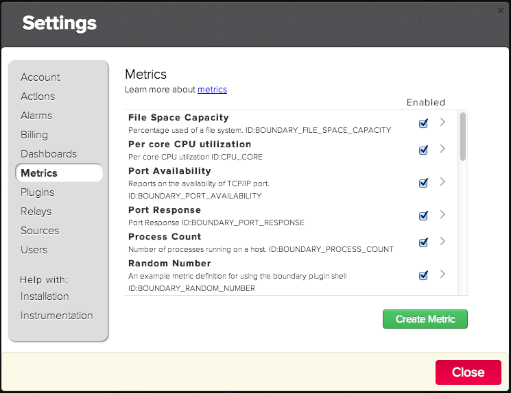
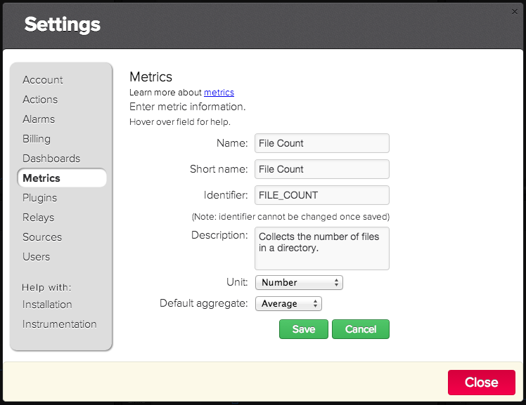
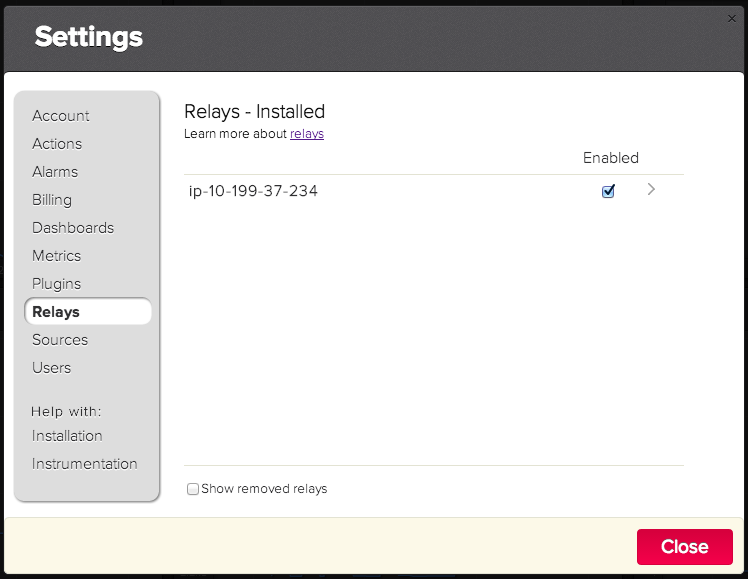
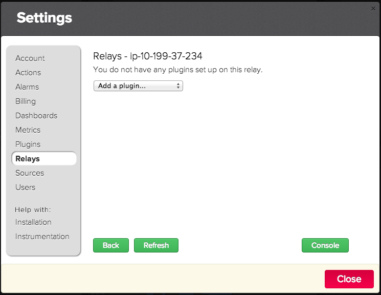
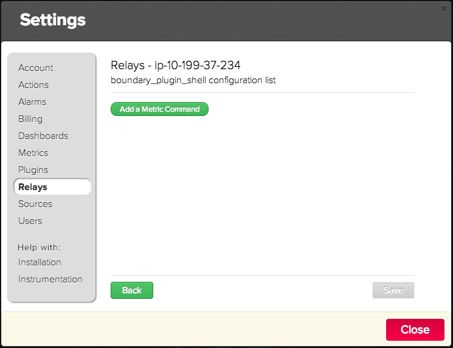
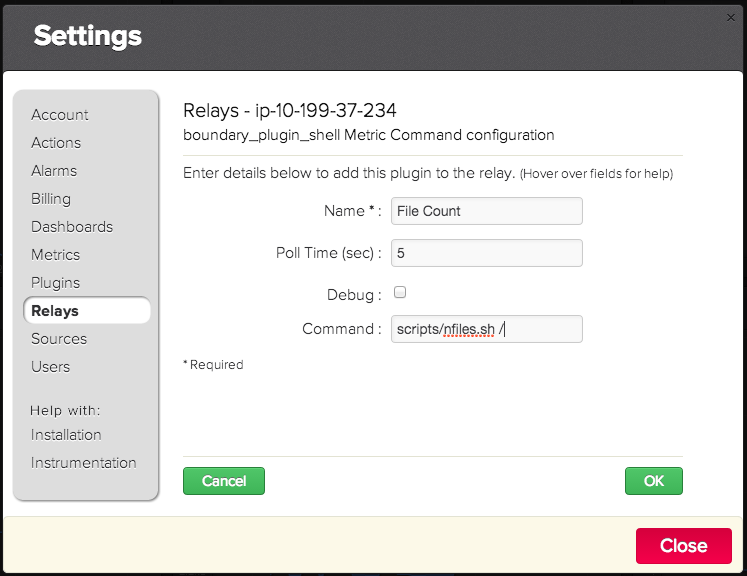
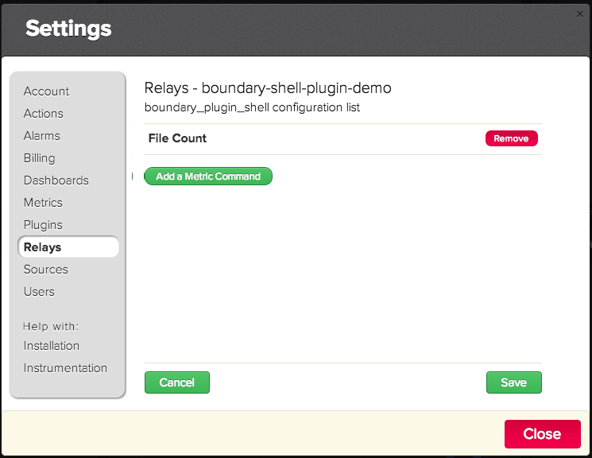
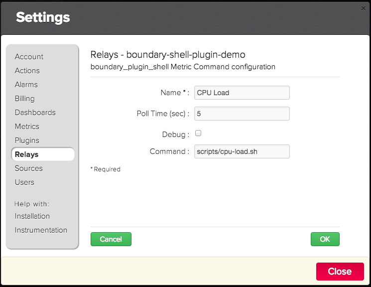
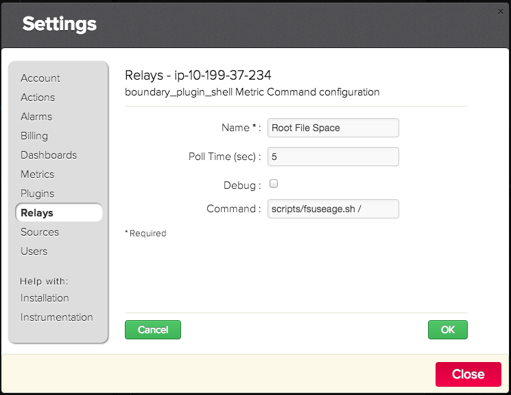
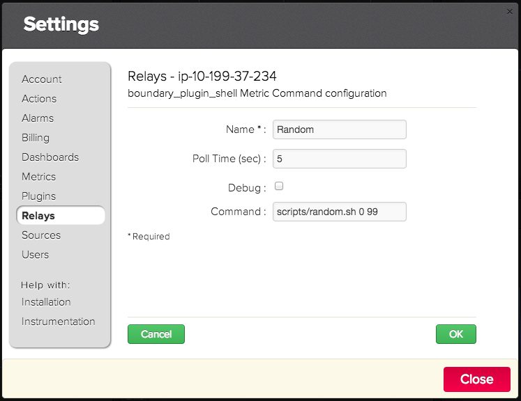

Boundary Shell Plugin
=====================

THIS IS UNOFFICIAL PLUGIN. DO NOT INSTALL UNLESS APPROVED BY BOUNDARY SUPPORT.
Shell plugin is generic plugin that allows the use of any program or scripting language to produce metrics for the Boundary product.

### Prerequisites

|     OS    | Linux | Windows | SmartOS | OS X |
|:----------|:-----:|:-------:|:-------:|:----:|
| Supported |   v   |    -    |    v    |  v   |


|  Runtime | node.js | Python | Java |
|:---------|:-------:|:------:|:----:|
| Required |         |    -   |      |

- [How to install node.js?](https://help.boundary.com/hc/articles/202360701)
- Once the Shell Plugin is installed, any metric to be collected requires additional configuration. 

### Plugin Setup

How to add new metrics?
1. Define the metric
2. Write the script that collects the metric (see _Shell Plugin Protocol_)
3. Configure the metric in the Shell plugin.

#### Configuring an Example Shell Plugin Metric

##### Defining a Metric

1. Login into Boundary Premium
2. Display the settings dialog by clicking on the _settings icon_: 

3. Click on _Metrics_ in the left hand side of the dialog which then displays the _Metrics_ dialog:


4. Click on the _Create Metric_ button which displays a form to define a new metric. Fill out the form as shown here:


5. Click on the _Save_ button to create the metric.

6. Click on the _Close_ button to dismiss the dialog.

##### Write a Script that Collects the Metric

This step is going to be short cut by providing an already created script the counts the number of files in a directory. The example script is called [nfiles](scripts/nfiles.sh)


##### Configuring a Metric within the Shell Plugin
1. Login into Boundary Premium
2. Display the settings dialog by clicking on the _settings icon_: 

3. Click on the _Relay_ to display the list of installed Relays.


4. Click on a relay in the list which then shows a list of the plugins installed on the Relay.


5. Click on the _Add a plugin_ drop down menu and select _shell_.


6. Click on the _Add a Metric Command_ fill out the form as shown here and the click on _OK_:


7. Click on the _Save_ button to save the configuration.


8. The relay console is then displayed showing the plugin loading. Click on the _Close_ button to dismiss the dialog.


##### Creating a Dashboard to Display the Metric

See [Building a Dashboard - How To](http://premium-support.boundary.com/customer/portal/articles/1635547-building-a-dashboard---how-to) to create a dashboard to display the metric configured above.

##### Enabling Debug

To aide in the development of your custom metric script you can enable debug, by checking the _Debug_ checkbox in the Metric Command definition form. This enables logging of the the command executed and the output that is produced by the command.

### Shell Plugin Protocol

Collection of your own defined metric requires a program or script to:

1. Collect, by any means the desired metric
2. Write the collected metric value, along with the metric name, and source to [standard output](http://en.wikipedia.org/wiki/Standard_output) with an accompanying new line.

Here is a Bash shell code snipet that illustrates:

```bash
#### Collect the metric

# List the directory, count the lines, and remove white space
file_count=$(ls -1 $directory_path | wc -l | tr -d ' ')

#### Write the metric standard out

echo "FILE_COUNT $file_count $(hostname)"
```

Here is yet another snipet that collects and outputs the processor load in a single line of code:

```bash
echo $(uptime) $(hostname) | awk '{printf("LOAD_1_MINUTE %s %s\nLOAD_5_MINUTE %s %s\nLOAD_15_MINUTE %s %s\n",$8,$11,$9,$11,$10,$11)}'
```
### Examples
Boundary Shell Plugin bundles several examples that illustrate how to create your metrics using a program or script:

- CPU Load
- File Space Capacity
- Process Count
- Port Scan
- Random
- Windows Power Shell

#### CPU Load

Collects the CPU load for the last 1,5,and 15 minute intervals.

Uses the following metrics:

- `BOUNDARY_CPU_LOAD_1_MINUTE`
- `BOUNDARY_CPU_LOAD_5_MINUTE`
- `BOUNDARY_CPU_LOAD_15_MINUTE`

Requires the following on the Relay host:

1. Bash shell
2. Posix utilities: `awk`, `hostname`, `uptime`

Example Command:

```bash
$ scripts/cpu-load.sh
```

Example Plugin Shell configuration:



#### File Space Capacity

Collects spaced used of a file system as a percentage of total space.

```bash
useage: fsuseage.sh <mount point>
```

Uses the following metrics:

- `BOUNDARY_FILE_SPACE_CAPACITY`

Requires the following on the Relay host:

1. Bash shell
2. Posix utilities: `awk`, `tail`
3. python 2.6.6 or later

Example Command:

```bash
$ scripts/fsuseage.sh /
```

Example Plugin Shell configuration:


#### Process Count

Measures the number of processes running on a host.

Uses the following metrics:

- `BOUNDARY_PROCESS_COUNT`

Requires the following on the Relay host:

1. Bash shell
2. Posix utilties: `egrep`,`grep`,`hostname`,`ps`,`tr`,`wc`

Example Command:

```bash
$ scripts/nprocs.sh
```

Example Plugin Shell configuration:




#### Port Scan

Checks the availability of TCP/IP _port_ on a specified _host_

Uses the following metrics:

- `BOUNDARY_PORT_AVAILABILITY`
- `BOUNDARY_PORT_RESPONSE`

Requires the following on the Relay host:

- Python 2.6.6 or later

Example Command:

```
$ scripts/portscan.py www.google.com 80
```

Example Plugin Shell configuration:


#### Random

Example scripts that outputs a random number between the values input to the script:
```bash
usage: random.sh <min> <max>

where:
  min is the smallest value to generate
  max is the largest value to generate
```

Uses the following metrics:

- `BOUNDARY_RANDOM_NUMBER`

Requires the following on the Relay host:

- Bash shell

Example Command:

```
$ scripts/random.sh 0 99
```

Example Plugin Shell configuration:


